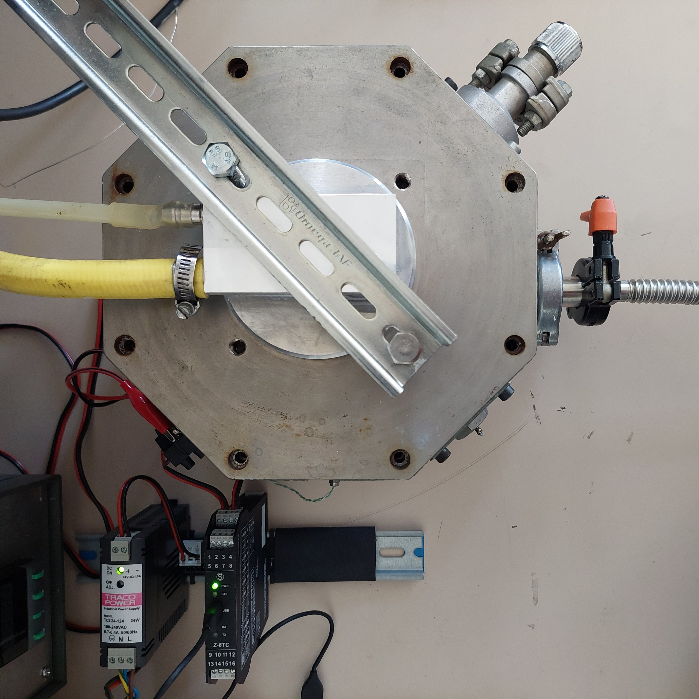
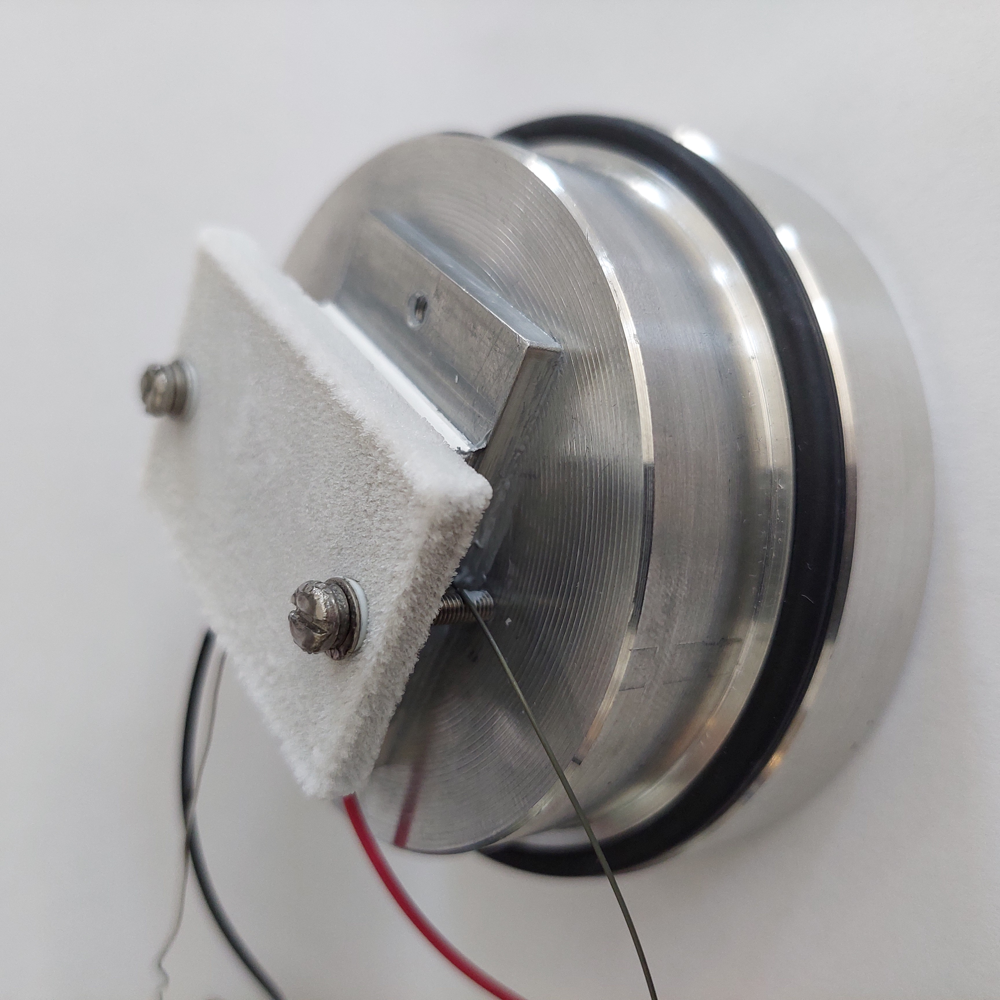
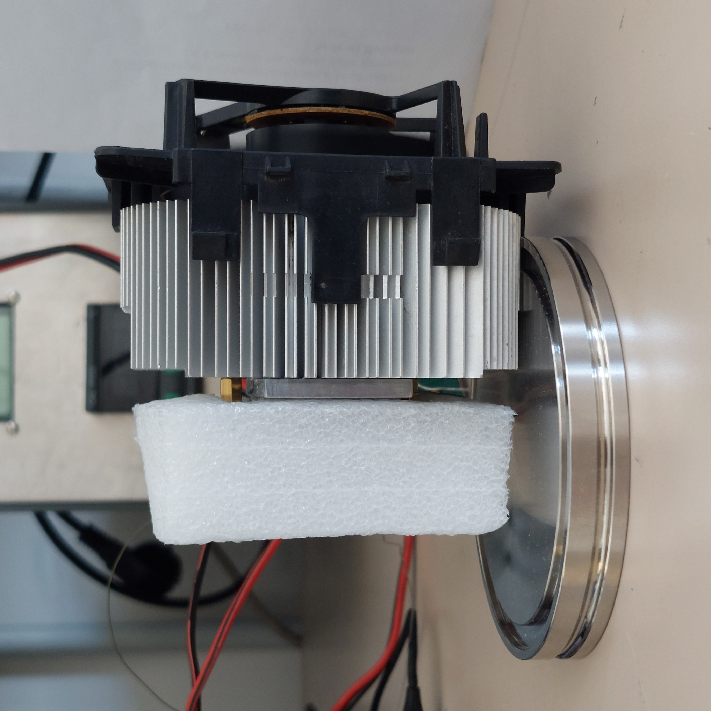
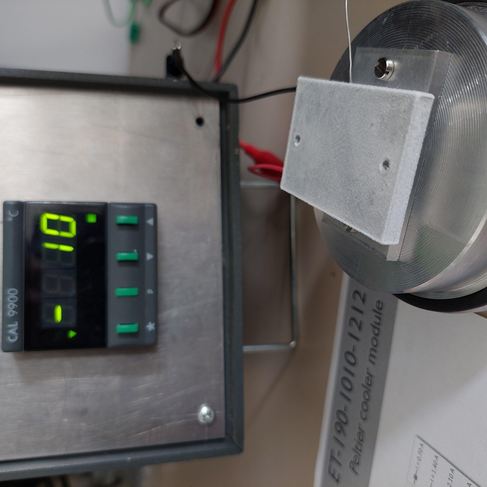
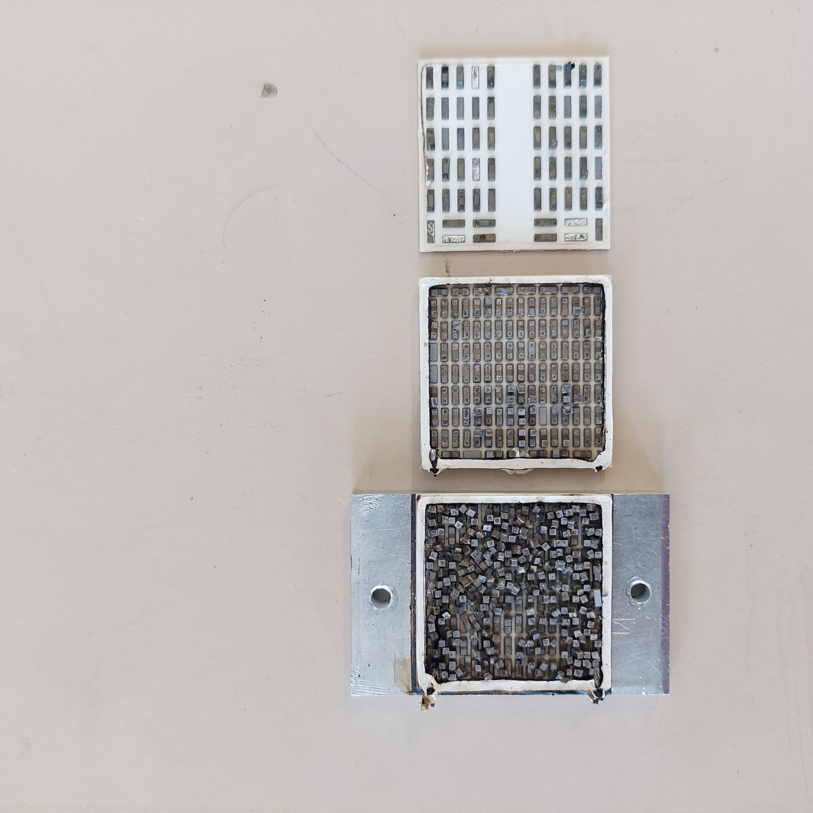

# EPICX journal
This journal is written backwards.

## Week 23 - Water cooling, lower heat lost
### Experiment - PE-16 in vacuum, water cooling
Here we cool down the Al cap with water flow at room temperature. 

The temperatures are stable now. Compare the results in air and vacuum:
| max T hot | min T cold | max &#0394;T diff | Note |
| --- | --- | --- | --- |
| 32.5 | -37.8 | 69.5 | In vacuum, cooling with water at room T | 
| 33.4 | -30.9 | 63.7 | In air, cooling with CPU cooler |

**Note:** As was observed earlier, in the vacuum we get -7&deg;C lower w.r.t. the in air condition.

## Week 22 - Compare Peltier in air, vacuum, with CPU cooler
### Risistance of Peltiers
Resistance of Peltier elements has to be measured at about 1kHz, to avoid thermoelectric effect. No LCR meter was found around, so we use a sine signal generator, amplifier and a resistance bridge with a regular multimeter.

AC resistance of a PE-16 is caculated as: $Rp = (Ua \cdot R / Ur) - 1$, 
where:
- Ua - Amplifier output voltage
- Ur - Bridge resistor voltage
- Rp - AC resistance of the peltier module

One measurements for a PE-16:
| Ua, mV | Ur, mV | Rp, Om |
| --- | --- | --- |
| 128.4 | 85.2 | 14.4 |

The AC resistance of all the PE-16 modules is about 14 Om, the PE-51 is about 13 Om. Note that the PN pellets of Peltier modules are connected in series, the **entire module fails** if only one pellet is dammaged.

### Experiment - PE-16 in air, fixed V
The PE-16 runs under fixed 5V, temperatures stabilise, then runs under 8V:
| V | A | T hot | T cold | T diff |
| --- | --- | --- | --- | --- |
| 5 | 0.73 | 29.2 | -2 | ~30 |
| 8 | 1.19 | 41.6 | -7 | ~49 |

### Experiment - T min -14&deg;C in air, fixed 8V
The PE-16 starts from a room temperature ander fixed 8V and I=1.5 max. What would be the minimal temperature?
| V | A | T hot | T cold | T diff | Note |
| --- | --- | --- | --- | --- | --- |
| 7.9 | 1.5 | 25.8 | 13 |  | Fixed I mode |
| 8 | 1.35 | 29.2 | -11 | ~40 | Fixed U mode |
| 8 | 1.35 | 30 | -14 | 44 | Min T cold |
| 8 | 1.3 | 32.5 | -14 | 46.5 | Max T diff |
| 8 | 1.27 | 34.4 | -13 | | T goes up |

### Experiment - T min -21&deg;C in vacuum, fixed 8V
The PE-16 starts from a room temperature under vixed 8V, in the vacuum camera. What would be the minimal temperature? We can't measure T hot due to lack of additional sensors in the vacuum camera.
| V | A | T hot | T cold | T diff | Note |
| --- | --- | --- | --- | --- | --- |
| 7.9 | 1.5 | | 21 |  | Fixed I mode |
| 8 | 1.27 | | -20 | | Fixed U mode |
| 8 | 1.23 | | -21 | | Min T cold |
| 8 | 1.23 | | -20 | | T goes up |

### Experiment - T min -23&deg;C in air, fixed 2.1A
The PE-16 start from a room temperature. Now we fix the current at 2.1A which is 75% of I max 2.8A. Higher currents are not reccomended. We observe minimal T cold = -23&deg;C and T diff = 67&deg;C before the temperatures rise.

Starging from this experiement the temperatures are recorded every second ina tab-separated file [TSV](https://en.wikipedia.org/wiki/Tab-separated_values). See the [log file](<logs/2024-05-28 163804.tsv>) for this experiment.

### Experiment - T min -31.5&deg;C in vacuum, fixed 2.1A
We [recorded](<logs/2024-05-29 113448.tsv>) minimal T cold -31.5&deg;C. For the fist time the temperature seems stable.

**Note:** In the vacuum the minimal T cold -7.5&deg;C lower (-31.5&deg;C) then in air (-23&deg;C) in the previous experiment.

### Experiment - T min -31&deg;C in air, CPU cooler + insulation
[Recorded](<logs/2024-05-30 151429.tsv>) min T cold -30.9&deg;C, max T diff 63.7&deg;C, max T hot 33.d&deg;C.

### Experiment - T min -29.3&deg;C in vacuum, T hot recorded
Added the second K-type thermocouple in the vacuum camera. The temperature of the hot side of the PE-16 is [recorded now](<logs/2024-05-31 154000.tsv>).The min T cold -29.3&deg;C, max T diff 79.8&deg;C, max T hot 57&deg;C.

**Note:** The temperature rises after the Al thermal mass is heated. Additional cooling is required. 

## Week 21 - Peltier runs and fails
Fist measurements tests.

### Temperature measurement errors
The CAL9900 controller shows 29&deg;C while the Fluke multimeter shows 23&deg;C with the same thermocouple. No equipment is calibrated. We can expect **high measurements errors** of absolute temperature values.

Neither the CAL9900 nor Fluke have outputs for temperature registrations. An options to do it could be to use existing data aqusition modules from [Seneca](https://www.seneca.it/), in particular `Z-8TC-1` module for thermocouples. The module can be connected to a laptop by USB, the measurements recieved using Modbus RTU protocol. For the later the `mbpoll` command line utility is choosen, with some wrapper scripting for data aqusition and logging (see the [mon](./mon) and [log](./log) files).

### Peltier glued with epoxy
The first setup with PE-16 is prepared. The hot and cold sides of the module are glued to Al plates (dimensions 50x30x4 mm) with Loctite bicomponent epoxy. A hole of 1mm diameter 20mm length is drilled in each plate for termocouples. This sandwich was mounted on the Al cap of the vacuum chamber.

### Experiments
In the first test we measure T at the cold side only. The V was increased gradually untill the I reached 1.5 A. The T went down to -11&deg;C.

In the second test (next day) the T went down to -4&deg;C only, much slower. The reason wasn't clear, so we decided to cool all the parts down to room temperature and start over again.

The R of the PE-16 was measured using a multimeter. It's not stable with DC, and decreases from kOms to Om gradually due to thermolectric effect.

In the third test (day later) the PE-16 had no current while increasing voltage from 0 to 15V. Resistance of the module coudn't be measured (like of isolator). It's clear the module is damaged.

To recover the glued Al plates for later use we put it to the owen at 300&deg;C for a few hours. The epoxy glue didn't burn out though. It did burn out in another owen at 350&deg;C.

The image below shows the internals of the PE-16. This module has two cascades, you can see that one cascade has about 120 simiconductor pellets, and the second cascade has twice the number of them.

The reason the Pelter module was damaged with no obviouse reason is likely due to different expansion coefficeints of the module and adherent Al plate, wich coused shear forces. It was found that bounding by adhesive is permitted, but is limited to small sizes of Peltier elements (i.e. [25 mm](https://customthermoelectric.com/tech-info/install/tec-installation.html)). In general, bonding with a glue isn't reccomended.

## Week 20 - Working space and Lab
Setup of the working space and the lab setup.

Preliminary studing:
* CO2 reduction
* Peltier module theory and usage

Equipment in the lab:
* Vacuum camera 
* Vacuum scroll pump
* Temperature controller CAL9900, with a K-type thermocouple 
* Power supply with U/I stabilisation
* Peltier modules:
    * ET2-196-19-14, [see docs at RS](https://docs.rs-online.com/f6bf/A700000008614874.pdf), 1 module. Reffered as **PE-51** in the following.
    * ET-190-1010-1212, [see docs at RS](https://it.rs-online.com/web/p/moduli-peltier/4901430), 4 modules. Reffered as **PE-16** in the following.

Heat exchange due to thermal raiation in the vacuum camera:
$Q = \sigma e A (T_1^4 - T_2^4)$, where:
* $\sigma = 5.67e10^{-8} W/(m^2 K^4)$, Stefan-Boltzmann constant
* $e = 1$ for black body, $e = 0.03$ for Al foil
* $A = 0.01 m^2$ assumed heat exchange surface
* $T_1 = 273 + 25$ room temperature
* $T_2 = 273 - 40$ cell temperature

The maximum heat exchange, given the black bodies, is 4.47 W. Wrapping with Al foil reduces the heat exchage down to 0.045 W.

**Note:** The specification for the PE-16 module states that the heat removed from the cold side is about 5 Watts at temperature difference 65&deg;C and the current 2.1A (75% of Imax). It's the same heat amount the cold side can get due to the thermal radiation in vacuum.
